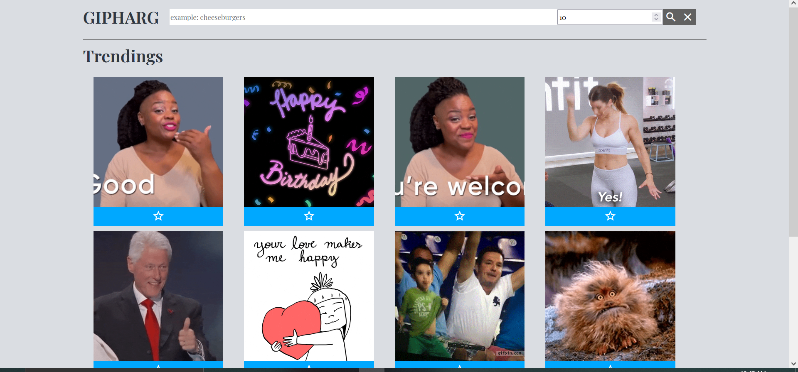
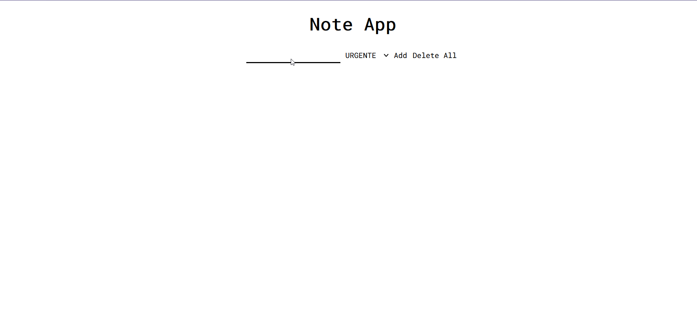
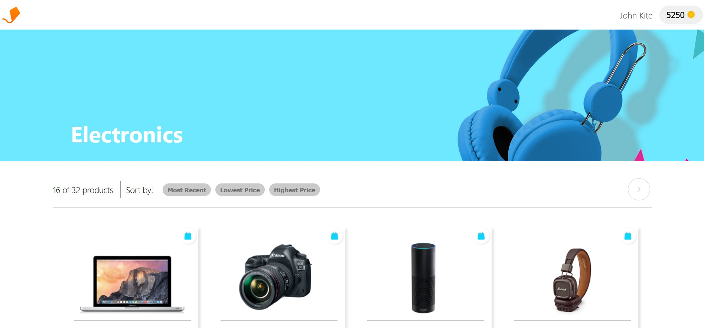
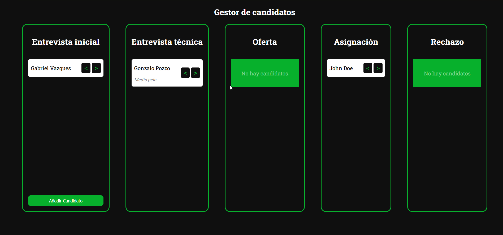

## Bienvenid@s! 🇦🇷 

**Soy un estudiante de Licenciatura en Informática en la Universidad Nacional de Quilmes, actualmente me encuentro en el area del desarrollo web, especificamente Front End.
Espero que disfrutes mi perfil.
   
Saludos 👋.**

## Stack de Tecnologias

     

## Proyectos
  
<table>
  <tr>
    <td align="center">
      <a href="https://jmsanchezdiaz.github.io/gipharg/">
         
        
          <h4>GIPHARG</h4>
        
      </a>
    </td>
    <td align="center">
      <a href="https://jmsanchezdiaz.github.io/note-app/">
         
        
          <h4>Note App</h4>
        
      </a>
    </td>
    <td align="center">
      <a href="https://jmsanchezdiaz.github.io/aerolabchallenge/">
         
        
          <h4>Aerolab Challenge</h4>
        
      </a>
    </td>
    <td align="center">
      <a href="https://jmsanchezdiaz.github.io/softvision-challenge/">
         
        
          <h4>Softvision Challenge</h4>
        
      </a>
    </td>
  </tr>
</table>

## Contactame
              

  
 
